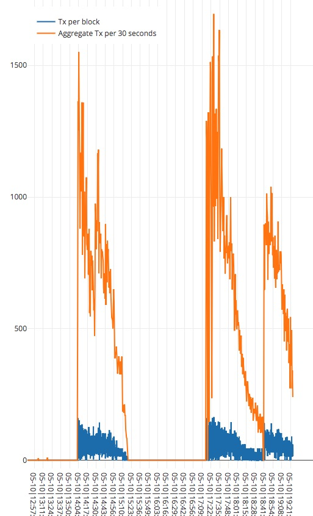
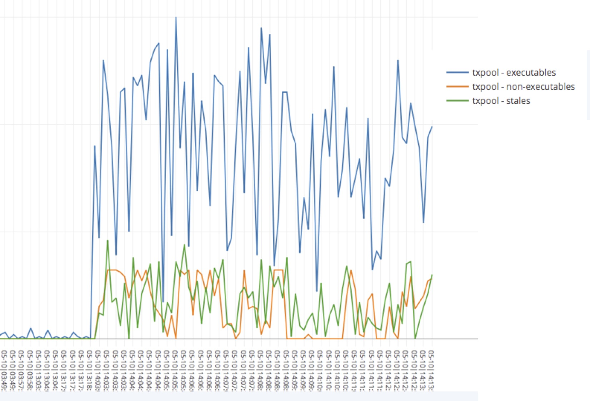

# Log Analyzers

Parses logs from the Quorum and Geth nodes and generate charts for these metrics:
* chart 1
  * transactions included in blocks by time stamp
  * total transactions included in blocks in 30sec intervals

* chart 2
  * transactions pool queues: executables, non-executables, stales

## Run It

```
npm install
PLOT_USER=<plotly.com user> PLOT_PWD=<plotly.com app key> INPUT=<the geth.log file> node geth-poa-logs.js
```

You should see output like the following:
```
...
Txs at 05-10|14:09:02: 28
Txs at 05-10|14:09:07: 100
Txs at 05-10|14:09:07: 61
Txs at 05-10|14:09:12: 57
Txs at 05-10|14:09:12: 72
Txs at 05-10|14:09:17: 80
Txs at 05-10|14:09:17: 75
Txs at 05-10|14:09:22: 38
Txs at 05-10|14:09:27: 77
Txs at 05-10|14:09:27: 17
Txs at 05-10|14:09:33: 33
Txs at 05-10|14:09:33: 93
Txs at 05-10|14:09:34: 30
Txs at 05-10|14:09:34: 107
Txs at 05-10|14:09:37: 101
Txs at 05-10|14:09:37: 46
Txs at 05-10|14:09:42: 51
Txs at 05-10|14:09:42: 62
Txs at 05-10|14:09:42: 32
Txs at 05-10|14:09:42: 4
Txs at 05-10|14:09:48: 113
Pool at 05-10|14:09:54: executable - 22,  non-executable - 0,   stale - 2
Pool at 05-10|14:10:02: executable - 83,  non-executable - 0,   stale - 26
Pool at 05-10|14:10:10: executable - 107,   non-executable - 0,   stale - 1
Pool at 05-10|14:10:18: executable - 85,  non-executable - 0,   stale - 11
Pool at 05-10|14:10:26: executable - 127,   non-executable - 0,   stale - 16
Pool at 05-10|14:10:34: executable - 66,  non-executable - 0,   stale - 6
Pool at 05-10|14:10:42: executable - 79,  non-executable - 0,   stale - 23
Pool at 05-10|14:10:50: executable - 108,   non-executable - 20,  stale - 34
Pool at 05-10|14:10:58: executable - 66,  non-executable - 32,  stale - 23
Txs at 05-10|14:09:49: 92
Txs at 05-10|14:09:49: 32
Txs at 05-10|14:09:52: 4
Txs at 05-10|14:09:52: 32
Txs at 05-10|14:09:52: 5
Txs at 05-10|14:09:57: 3
Txs at 05-10|14:09:57: 62
...
Chart available at: https://plot.ly/~<PLOT_USER>/49
Chart available at: https://plot.ly/~<PLOT_USER>/51
```

## Example charts created by the tool:

Showing transaction rates per block and per 30sec period aggregates:


Showing transaction pool status:


